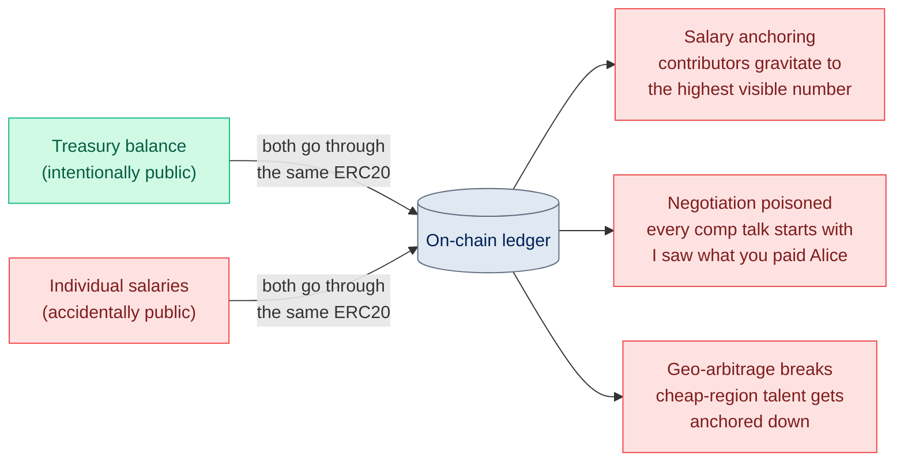
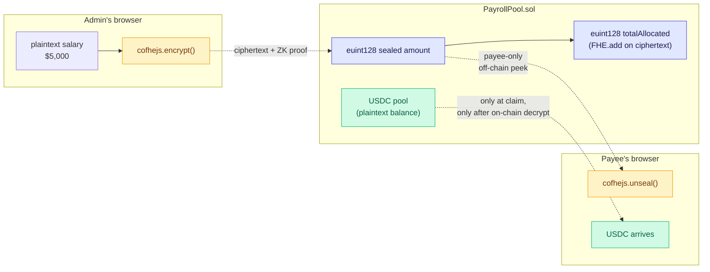
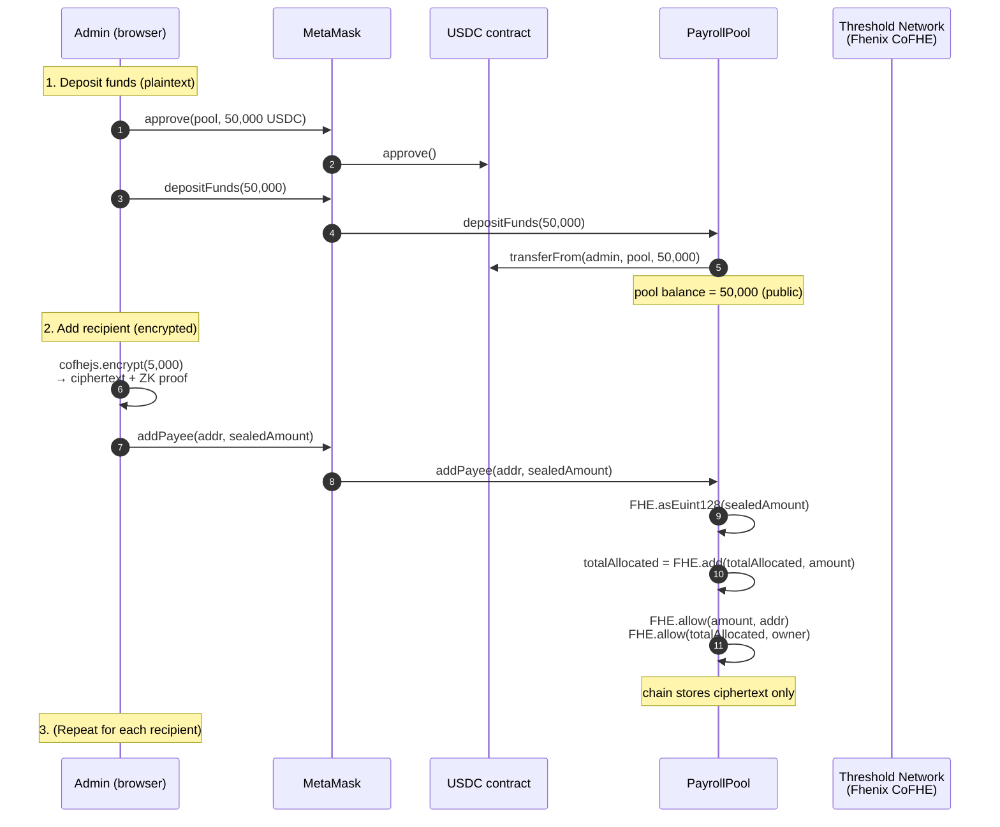
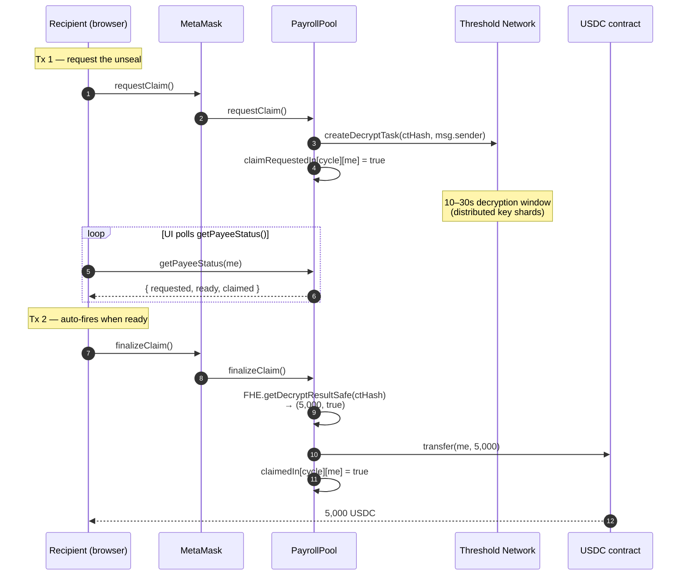
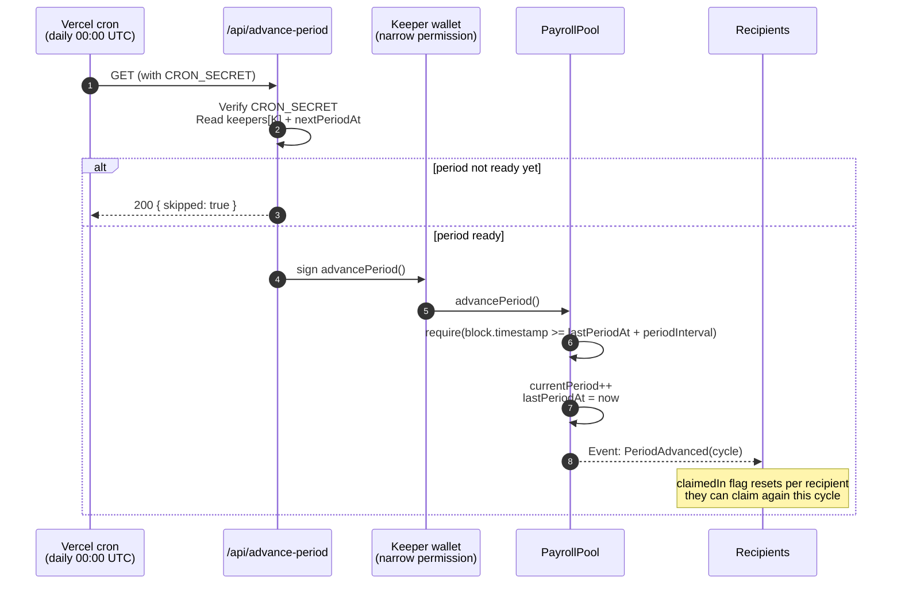
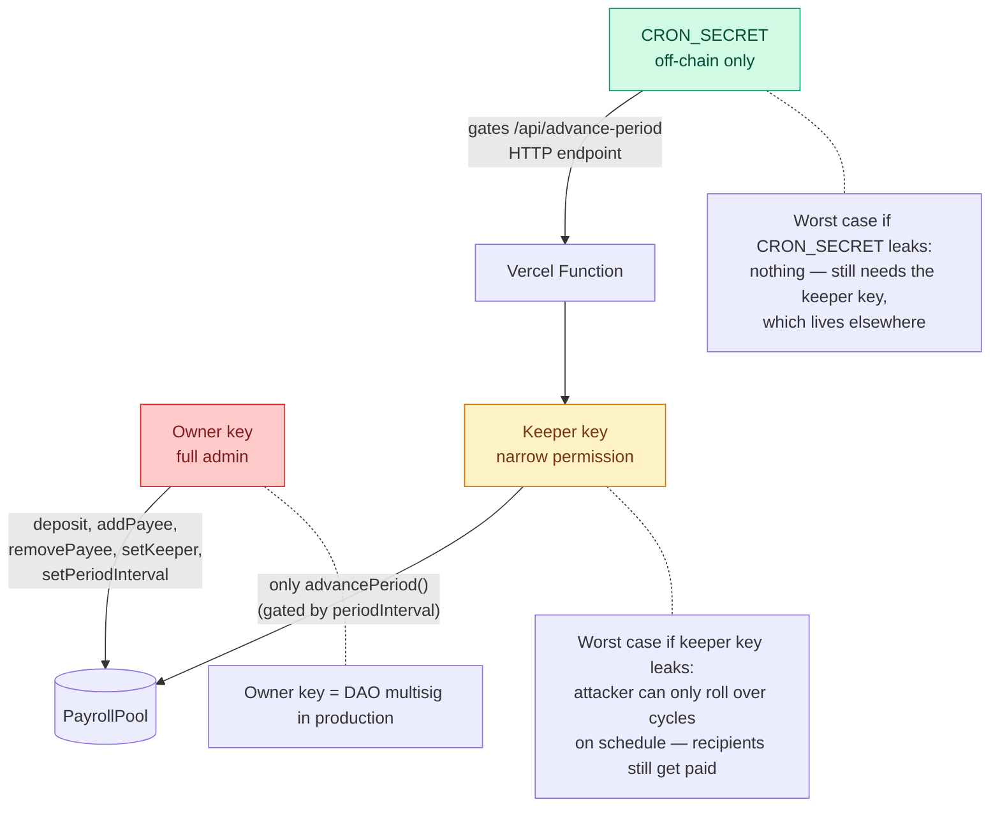

# Blind Ledger

**Private payroll for crypto teams.** Each contributor's salary is sealed with Fhenix FHE — only the recipient can unseal their own number. The DAO sees only an encrypted aggregate. Payroll cycles auto-advance via a Vercel cron + on-chain keeper.

Built for the Fhenix "Private By Design" buildathon · Wave 4.

> **Live: https://blindledger.vercel.app**
> **Contract: [`0xbc2933EE60D9FcB1d1F7602A01CB54688CFC7028`](https://sepolia.arbiscan.io/address/0xbc2933EE60D9FcB1d1F7602A01CB54688CFC7028)** (Arbitrum Sepolia)
> **Source: https://github.com/fozagtx/blind-Ledger**

---

## The problem

Every DAO contributor's salary is on a public ledger. **Treasury transparency is a feature; individual pay being public is a leak.** The blockchain doesn't distinguish them by default.



### The three concrete failure modes

1. **Salary anchoring.** When every salary is visible, comp gravitates to the highest visible number. Talented people in expensive markets walk away from the "fair" rate.
2. **Negotiation poisoned.** Every comp conversation starts with "I saw what you paid Alice." You can't run a compensation strategy when the whole table is on stage.
3. **Treasury ≠ payroll, but the chain treats them the same.** Showing the treasury is good. Showing individual amounts is a leak. The default behaviour leaks both.

---

## The solution

Allocate sealed, settle plaintext. Each salary is encrypted client-side as an `euint128` (Fully Homomorphic Encryption over 128-bit integers) before it ever touches the wire. The contract can do arithmetic on those ciphertexts directly — sum them, store them, route them — without ever reading the underlying values. Only at claim time does the recipient (and *only* the recipient) trigger an unseal that decrypts to plaintext for the ERC20 transfer.



### What's visible vs sealed

| What | On-chain visibility | Who can unseal |
|---|---|---|
| Pool USDC balance | **plaintext**| anyone (it's an ERC20 balance) |
| Recipient addresses | **plaintext**| anyone |
| Number of recipients | **plaintext**| anyone |
| **Individual salary**| `euint128` ciphertext only | **only that recipient** (via `cofhejs.unseal`) |
| **Aggregate payroll total**| `euint128` ciphertext only | **only the DAO owner**|
| Current cycle # | **plaintext**| anyone |
| The actual transfer at claim time | plaintext `Transfer(amount)` event | anyone *(unavoidable — ERC20)* |

The privacy boundary is **allocation strategy, not custody.** Treasury size has always been public; what you pay each contributor hasn't been — until now.

---

## How it works end-to-end

### Admin flow — set up payroll



### Payee flow — claim sealed pay



### Recurring cycles — set it and forget it



---

## Architecture decisions (deltas from the original PRD)

- **`euint128`, not `euint256`.** USDC has 6 decimals; `euint128` fits ~$10²⁰ of payroll. Half the gas of `euint256`.
- **`totalDeposited` is plaintext.** The contract's USDC balance is already public via the ERC20. Encrypting it adds gas with zero privacy gain. The only encrypted total is `totalAllocated` (sum of all salaries).
- **Claim is two transactions behind one button.** CoFHE on-chain decryption is async — `ITaskManager.createDecryptTask` queues with the Threshold Network, then `FHE.getDecryptResultSafe(handle)` returns `(value, ready)` after ~10-30s. The UI fires `requestClaim()`, polls `getPayeeStatus`, then auto-fires `finalizeClaim()` which does the USDC transfer. Single-button UX, two MetaMask popups.
- **Recurring via period counter + cron keeper.** A `currentPeriod` bumps each cycle; per-period `claimedIn[period][payee]` lets the same encrypted salary unlock each cycle. `advancePeriod()` is callable by the owner OR an authorized `keeper`, gated by `periodInterval` so a leaked keeper key can't fast-forward.
- **Real Circle USDC on Arbitrum Sepolia, no mock token.** Circle's official testnet USDC at `0x75faf114eafb1BDbe2F0316DF893fd58CE46AA4d`.
- **`@fhenixprotocol/cofhe-contracts@0.1.3` API quirk.** This version removed the `FHE.decrypt(handle)` wrapper — we call `ITaskManager(TASK_MANAGER_ADDRESS).createDecryptTask` directly. Encrypted handles are now `bytes32` internally; views cast to `uint256` for cleaner ABI typing against cofhejs's `ctHash: bigint`.
- **Explicit gas override per write.** Arb Sepolia base fees are microgwei but volatile — MetaMask's oracle frequently undershoots, causing reverts with "maxFeePerGas < base fee." Every `writeContractAsync` ships an explicit `maxFeePerGas: 0.5 gwei` (25× current base) so the wallet can't undershoot. Users only pay the actual base × gas used.

---

## Tech stack

```mermaid
graph TB
 classDef chain fill:#FFE5B0,stroke:#FF6B35,color:#7C2D12
 classDef app fill:#E0E7FF,stroke:#4F46E5,color:#1E1B4B
 classDef infra fill:#D1FAE5,stroke:#10B981,color:#065F46

 subgraph Onchain["On-chain (Arbitrum Sepolia)"]
 Sol["PayrollPool.sol<br/>(Solidity 0.8.25)"]:::chain
 CoFHE["Fhenix CoFHE<br/>(threshold network)"]:::chain
 USDC["Circle USDC<br/>(real testnet)"]:::chain
 end

 subgraph App["Frontend (Vite + React)"]
 UI["wagmi v2<br/>+ RainbowKit<br/>+ viem"]:::app
 FHE_C["cofhejs 0.3.1<br/>(WASM, tfhe)"]:::app
 Motion["framer-motion<br/>+ Tailwind<br/>+ Instrument fonts"]:::app
 end

 subgraph Server["Serverless"]
 API["Vercel Functions<br/>/api/advance-period"]:::infra
 Cron["Vercel Cron<br/>(daily)"]:::infra
 end

 UI -->|reads/writes| Sol
 FHE_C -->|encrypts off-chain| Sol
 FHE_C -.->|unseals via| CoFHE
 Sol -.->|decrypt requests| CoFHE
 Sol -->|ERC20.transfer| USDC
 Cron --> API
 API -->|advancePeriod()| Sol
```

---

## Live deployment

### Contracts on Arbitrum Sepolia (chain id `421614`)

| Item | Address |
|---|---|
| **PayrollPool** (this project) | [`0xbc2933EE60D9FcB1d1F7602A01CB54688CFC7028`](https://sepolia.arbiscan.io/address/0xbc2933EE60D9FcB1d1F7602A01CB54688CFC7028) |
| **USDC** (Circle's official testnet) | [`0x75faf114eafb1BDbe2F0316DF893fd58CE46AA4d`](https://sepolia.arbiscan.io/address/0x75faf114eafb1BDbe2F0316DF893fd58CE46AA4d) |
| **Fhenix CoFHE Task Manager**| [`0xeA30c4B8b44078Bbf8a6ef5b9f1eC1626C7848D9`](https://sepolia.arbiscan.io/address/0xeA30c4B8b44078Bbf8a6ef5b9f1eC1626C7848D9) |
| **L1 Inbox** (for bridging Sepolia → Arb Sepolia ETH) | [`0xaAe29B0366299461418F5324a79Afc425BE5ae21`](https://sepolia.etherscan.io/address/0xaAe29B0366299461418F5324a79Afc425BE5ae21) |

### Wallets (testnet — pre-funded for demo)

| Role | Address | Private key (testnet ONLY) |
|---|---|---|
| **DAO admin / contract owner**| [`0x73dD81a4C5d67E831291a4Bc49B26D590dee3caD`](https://sepolia.arbiscan.io/address/0x73dD81a4C5d67E831291a4Bc49B26D590dee3caD) | `0xdd7cfc755447e677da3789e8f0a56b04bf03eb3514d2bcc54533ead115cbe83c` |
| **Cron keeper** (authorized to call `advancePeriod()` only) | [`0xA1f0373c75E4d0Af2c8cA2916c5CCE028A27dA72`](https://sepolia.arbiscan.io/address/0xA1f0373c75E4d0Af2c8cA2916c5CCE028A27dA72) | `0x0e2e2a1c5d6af298cdcd3431e72b43cd80780c0402a4e3c58e8552a5de248e8e` |

> **Testnet only.** These keys are public, posted in this README, and meant for demo. **Never send mainnet funds to either wallet**— anyone with the README can sweep them.

### Settings

| Item | Value |
|---|---|
| **`periodInterval`**| `300 s` (5 min — short for demo; production default is `2592000` / 30 days) |
| **`currentPeriod`**| bumps via `advancePeriod()`; reset for each fresh demo |

### Reference transactions

| Action | Tx |
|---|---|
| **Contract deploy**| [`0xc3c4d3b3c3f5f8ab29f706bf1490d2d967fe5aa0995a4d0286b9d268216e4963`](https://sepolia.arbiscan.io/tx/0xc3c4d3b3c3f5f8ab29f706bf1490d2d967fe5aa0995a4d0286b9d268216e4963) |
| **Sepolia → Arb Sepolia bridge**| [`0x32d94bc4344ad7d1ec5381774446572313aa2a2c80ab4450a595e2c536a83103`](https://sepolia.etherscan.io/tx/0x32d94bc4344ad7d1ec5381774446572313aa2a2c80ab4450a595e2c536a83103) (L1 side) |
| **End-to-end cron verify** (`advancePeriod` via keeper) | manually verified via `pnpm verify:cron` — see `contracts/scripts/verify-cron.ts` |

### Faucets you'll need

| What | Where |
|---|---|
| Arb Sepolia ETH (for gas) | [QuickNode](https://faucet.quicknode.com/arbitrum/sepolia) · [Alchemy](https://www.alchemy.com/faucets/arbitrum-sepolia) (both require small mainnet balance) · [Google Cloud Sepolia](https://cloud.google.com/application/web3/faucet/ethereum/sepolia) (then bridge via `pnpm bridge`) |
| Arb Sepolia USDC | [Circle](https://faucet.circle.com) — pick **Arbitrum Sepolia**· [Aave staging](https://staging.aave.com/faucet/) · [Bware Labs](https://bwarelabs.com/faucets/arbitrum-sepolia) |

---

## Project layout

```
blind-ledger/
├── contracts/
│ ├── contracts/PayrollPool.sol # FHE-encrypted payroll, recurring cycles, keeper allowlist
│ ├── scripts/
│ │ ├── deploy.ts # deploys + writes address to frontend/.env.local
│ │ ├── bridge.ts # Sepolia → Arb Sepolia native ETH bridge
│ │ ├── bridge-status.ts # poll both chain balances
│ │ └── verify-cron.ts # end-to-end Vercel cron simulation
│ ├── hardhat.config.ts # solidity 0.8.25, viaIR, evmVersion: cancun
│ └── .env.example
├── frontend/
│ ├── src/
│ │ ├── App.tsx # role-aware router (Landing | Admin | Recipient)
│ │ ├── components/
│ │ │ ├── BrandMark.tsx # logo (mark + wordmark)
│ │ │ ├── Header.tsx # sticky, frosts on scroll
│ │ │ ├── Landing.tsx # marketing page (Hero, Problem, Solution, FAQ, About)
│ │ │ ├── Logos.tsx # Arbitrum / Fhenix / USDC inline SVGs
│ │ │ ├── Sidebar.tsx # connected-state nav (Overview / Schedule / Add member)
│ │ │ ├── DashboardPanels.tsx # one panel per sidebar view (with hash routing)
│ │ │ ├── PublicView.tsx # encrypted aggregate + pool stats
│ │ │ ├── DepositCard.tsx # USDC approve + deposit
│ │ │ ├── AddPayeeCard.tsx # client-side encryption via cofhejs
│ │ │ ├── PayeeListAdmin.tsx
│ │ │ ├── PeriodCard.tsx # cycle + countdown + manual advance
│ │ │ ├── KeeperCard.tsx # authorize/revoke cron keeper
│ │ │ └── ClaimCard.tsx # peek (off-chain) + claim (2-tx state machine)
│ │ ├── hooks/
│ │ │ ├── useFHE.ts # initializes cofhejs against viem
│ │ │ └── usePayrollPool.ts # contract reads + role detection
│ │ └── lib/
│ │ ├── config.ts # chain + addresses + gasOverride
│ │ ├── abi.ts # PayrollPool + ERC20 ABIs
│ │ ├── fhe.ts # encryptUint128, unsealUint128
│ │ └── format.ts # USDC formatting, address shortener
│ ├── api/
│ │ ├── advance-period.ts # Vercel cron handler — keeper signs advancePeriod()
│ │ └── health.ts
│ ├── vercel.json # cron schedule (default: daily 00:00 UTC)
│ ├── tailwind.config.js # navy / blue palette, Instrument fonts, neumorphic
│ └── vite.config.ts # wasm + top-level-await plugins for cofhejs
└── README.md
```

---

## Tech stack details

| Layer | Choice |
|---|---|
| Contract language | Solidity `^0.8.25` (viaIR, evmVersion `cancun`) |
| FHE library | `@fhenixprotocol/cofhe-contracts@0.1.3` |
| Token standard | OpenZeppelin Contracts `^5.0.2` (IERC20 + SafeERC20) |
| Build / test | Hardhat 2.22, `@nomicfoundation/hardhat-toolbox` |
| Frontend framework | React 18 + Vite 5 + TypeScript |
| Styling | Tailwind 3 + custom tokens, Instrument Sans/Serif + Space Mono via fontsource |
| Wallet | wagmi 2 + RainbowKit 2 + viem 2 |
| FHE client | `cofhejs@0.3.1` (web entry, wasm via `vite-plugin-wasm` + `vite-plugin-top-level-await`) |
| Animation | framer-motion 12 |
| Icons | lucide-react |
| Serverless | Vercel Functions (`@vercel/node`) for the cron handler |
| Cron | Vercel cron (`vercel.json`) |

---

## Prerequisites

- Node 20+ (Hardhat warns on 25 but works), `pnpm` (or npm/yarn)
- A wallet with **Arbitrum Sepolia** ETH for gas
- **Circle's testnet USDC** on Arb Sepolia — [Circle faucet](https://faucet.circle.com)
- (Optional, for the live frontend) WalletConnect project id — [free at cloud.walletconnect.com](https://cloud.walletconnect.com)
- (For the cron) a Vercel account

---

## 1. Deploy the contract

```bash
cd contracts
cp .env.example .env
# fill in:
# PRIVATE_KEY — deployer key (this account becomes the DAO admin)
# ARBITRUM_SEPOLIA_RPC_URL — default: https://sepolia-rollup.arbitrum.io/rpc
# USDC_ADDRESS — already filled to Circle's testnet USDC
# PERIOD_INTERVAL_SECONDS — 300 for demo, 2592000 (30 days) for production
# KEEPER_ADDRESS — optional; if set, deploy script auto-authorizes
pnpm install
pnpm compile
pnpm deploy
```

The deploy script writes the contract address into `frontend/.env.local` automatically, and (if `KEEPER_ADDRESS` is set) authorizes the keeper in the same run.

If your deployer wallet only has Sepolia ETH and you need to bridge to Arb Sepolia:

```bash
pnpm bridge # sends most of your Sepolia balance through Arbitrum's L1 Inbox
pnpm bridge:status # poll both chain balances; takes ~10-15 min to land
```

---

## 2. Verify the Vercel cron locally before deploying it

```bash
cd contracts
pnpm verify:cron
```

This runs the exact same handler logic as `frontend/api/advance-period.ts` against the live contract, and asserts:
1. Bad `CRON_SECRET` → 401
2. Missing env → 500
3. Authorized keeper + ready period → real `advancePeriod()` tx, period increments
4. Immediate retry → structured `skipped: true` (interval not elapsed)

If all four pass, the Vercel function will too — it's the same code.

---

## 3. Run the frontend locally

```bash
cd frontend
cp .env.example .env.local
# Frontend address vars are already filled by the deploy script.
# Add VITE_WALLETCONNECT_PROJECT_ID for production wallet support.
pnpm install
pnpm dev
```

Open `http://localhost:5173`. Connect:
- The **deployer wallet**→ admin sidebar (Overview · Schedule · Add member)
- A wallet that was added via "Add a member" → recipient sidebar (Overview · Get paid)

---

## 4. Deploy to Vercel + wire the cron

```bash
cd frontend
vercel link

# Browser (Vite) — visible to client
vercel env add VITE_PAYROLL_POOL_ADDRESS # 0xbc2933EE60D9FcB1d1F7602A01CB54688CFC7028
vercel env add VITE_USDC_ADDRESS # 0x75faf114eafb1BDbe2F0316DF893fd58CE46AA4d
vercel env add VITE_CHAIN_ID # 421614
vercel env add VITE_WALLETCONNECT_PROJECT_ID # cloud.walletconnect.com

# Serverless (cron only — never reaches the browser)
vercel env add KEEPER_PRIVATE_KEY # 0x… — dedicated wallet, narrow permission
vercel env add CRON_SECRET # long random string
vercel env add ARBITRUM_SEPOLIA_RPC_URL
vercel env add PAYROLL_POOL_ADDRESS

vercel --prod
```

Then, as the DAO admin, authorize the keeper via the UI: **Schedule → paste keeper address → Trust**. Vercel's cron then calls `/api/advance-period` on its schedule (default: daily 00:00 UTC, configurable in `vercel.json`). The function pre-flights `keepers[address]` and `nextPeriodAt`, returns `skipped: true` if the interval hasn't elapsed, and only sends a tx when ready.

**Vercel Hobby plan note:** cron is daily-minimum on Hobby. For an every-5-min demo cadence (`*/5 * * * *`) you need Pro.

---

## Demo script

```
1. Admin connects.
 "I'll deposit 50,000 USDC into payroll."
 Overview panel → Funds section → enter amount → Allow USDC → Add funds.
 Pool balance updates.

2. "Adding three contributors with sealed salaries."
 Add member × 3:
 Alice 5,000
 Bob 8,000
 Carol 3,500
 Amount is encrypted CLIENT-SIDE before the tx — admin never sends plaintext over the wire.

3. "The total payroll handle changes, but no one can read 16,500 from this page."
 Overview shows ciphertext blob 0x… — only the owner can unseal the sum.
 Add member panel's team list shows 3 sealed pay packets.

4. Switch to Alice's wallet → Recipient sidebar.
 Get paid → sealed pay packet for cycle #1.
 Optional: hit "Peek" → cofhejs.unseal() runs off-chain → reveals 5,000 USDC, no gas.

5. Click Get paid:
 - Tx 1: requestClaim() — queues threshold-network decryption
 - "Unsealing your pay…" (~10-30s, UI polls)
 - Tx 2: finalizeClaim() — auto-fires when ready → USDC transfers
 "5,000 USDC claimed."

6. Switch to Bob → he can NOT see Alice's amount, only his own.
 The aggregate ciphertext didn't change shape. Math checked out — privacy preserved.

7. Cycle mechanic: Schedule panel counts down to next payday.
 Vercel cron fires advancePeriod() when due. Alice's "claimed" flag resets
 for the new cycle, and she can claim her 5,000 again next cycle.
```

---

## Security model



- **Owner key**= full admin (deposit, add/remove recipients, set keeper). Treat as DAO multisig.
- **Keeper key** lives in Vercel env vars. Its on-chain permission is *only* `advancePeriod()`. It cannot move funds, change salaries, or skip the `periodInterval` check.
- **Worst case if keeper key leaks:** attacker can call `advancePeriod()` whenever the interval has elapsed. Net effect: legitimate recipients get paid on schedule (which is what they wanted anyway). The owner can `setKeeper(addr, false)` to revoke instantly.
- **`CRON_SECRET`**ensures only Vercel's cron runtime can hit `/api/advance-period`. A leaked secret has no on-chain consequences — still needs the keeper key, and that lives separately.
- **FHE access control:**`FHE.allow(amount, payee)` grants only the payee permission to off-chain-unseal their own salary. `FHE.allow(totalAllocated, owner)` grants only the owner permission to unseal the aggregate.

---

## Out of scope (intentionally)

- Multi-token / non-USDC payroll
- Variable per-cycle amounts (bonuses, vesting cliffs)
- Multi-sig admin (use a Safe as the owner address — already compatible)
- Off-chain invoice uploads, governance, gating by reputation
- Mobile app

This is an MVP. The privacy primitive is the point; everything above can be bolted on later.

---

## Links

- **Live app**: https://blindledger.vercel.app
- **PayrollPool contract**: [Arbiscan](https://sepolia.arbiscan.io/address/0xbc2933EE60D9FcB1d1F7602A01CB54688CFC7028)
- **Source**: https://github.com/fozagtx/blind-Ledger
- **Fhenix CoFHE docs**: https://cofhe-docs.fhenix.zone
- **Arbitrum Sepolia explorer**: https://sepolia.arbiscan.io
